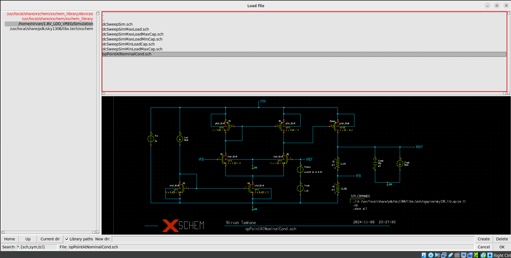
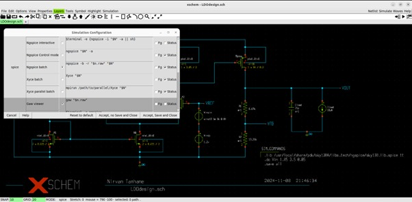
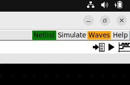
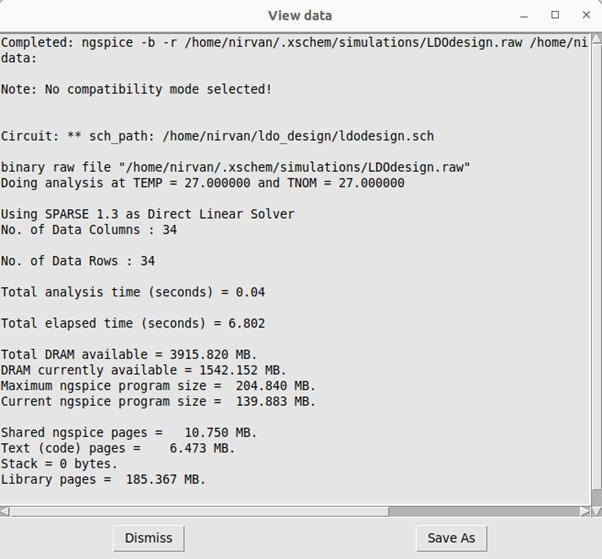
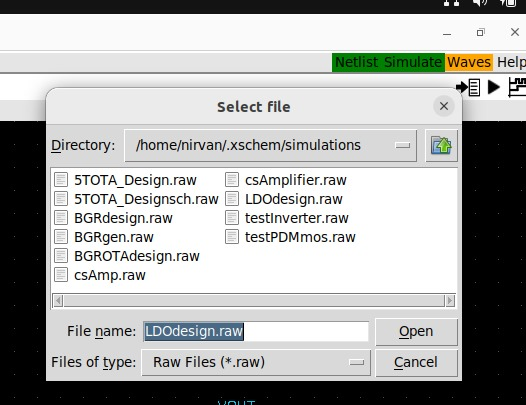
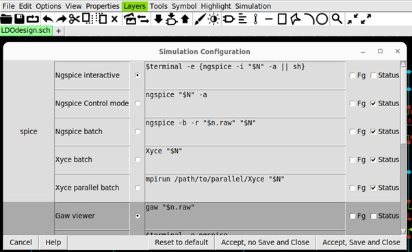
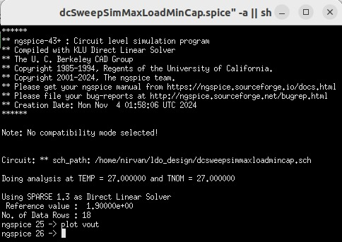

# 1.8V CMOS Low Drop-Out Regulator Design
This project simulates the designed LDO regulator circuit to determine its pre-layout performance characteristics.

## A Glance at the 1.8V LDO Regulator IP

To learn more about LDO Regulators, their principle of generation, implementation, issues & improvements, consider reading [this](/Documentation/BGR.pdf).

To gain insight into the applications and significance of LDO Regulators in VLSI, look at [this](/Documentation/Applications.pdf).

The  Design Specifications of the designed LDO Regulator Circuit can be found [here](/Documentation/Specifications.pdf).

## Block Diagram of the 1.8V LDO Regulator IP

 <p align="center">
  
</p>

## Circuit Diagram of the 1.8V LDO Regulator IP

 <p align="center">
  
</p>

## 1.8V LDO Regulator Performance Parameters 

| Parameter| Description| Min | Type | Max | Unit | Condition |
| :---:  | :-: | :-: | :-: | :---:  | :-: | :-: |
|Technology| 130 nm CMOS Process using Skywater 130 pdk|
|ILoad|Load current at Vout terminal | 10|||mA|Vin=2.0V, T=27C|
|CLoad|Load capacitance at Vout terminal|||25|pF|Vin=2.0V, T=27C, IL=1mA|
|Vout|Output voltage|1.792 |1.8002|1.8005|V|Vin=1.85V - 3.6V, T=27C|
|Vin|Supply Voltage|1.85|2.0|3.6|V|T=-40C to 125C|
|ISSpd|PMOS Driver Supply Current||90||uA|
|ISSopamp|5T-OTA Amplifier Supply Current||10||uA|
|Line Regulation|(ΔVout/ΔVin)*100%||0.43||%|
|Load Regulation|[(ΔVout/ΔVin)*100%]/ΔVin||0.215||%|

## Pre-Layout Performance Characteristics

###  Vout v/s Vin [1.85V - 3.6V] @ IL = 10uA & CL = 25pF


 <p align="center">
  
</p>

<p align="center">
  
</p>

<p align="center">
  
</p>

###  Vout at Vin [1.85V - 3.6V] @ IL = 10uA & CL = 20pF


 <p align="center">
  
</p>

###  Vout at Vin [1.85V - 3.6V] @ IL = 10uA & CL = 30pF


 <p align="center">
  
</p>

### Vout at Vin [1.85V - 3.6V] @ IL = 1mA & CL = 25pF


 <p align="center">
  
</p>

### Vout at Vin [1.85V - 3.6V] @ IL = 1mA & CL = 20pF


 <p align="center">
  
</p>

###  Vout at Vin [1.85V - 3.6V] @ IL = 1mA & CL = 30pF


 <p align="center">
  
</p>


## Tools used and steps to reproduce all waveforms (Tools allowed are xschem/eSim/ngspice) 
Ngspice is an open-source mixed-signal circuit simulator.

### Follow the following steps if you don't use an Ubuntu system:
#### Installing Ubuntu on Windows (WSL)
Steps:
* Download Oracle Virtual Box.
* Download the Ubuntu v22.04 .iso disk image file.
* Create a new VM using the image file.

Please refer the following video to install ubuntu on your windows PC:
```
https://youtu.be/F8ngtWC0wbg?si=QZ5bzmx7Xl0prH5d
```

#### After innstalling Ubuntu on Windows follow these steps:
Please refer the following video to give sudo access to the user: 
```
https://youtu.be/ERh74y-3EW8?si=Dhhi8bF1wqugm3AO
```
Open your terminal and type the following to install Linux packages: 
```
# sudo apt update; 
# sudo apt install build-essential dkms linux-headers-$(uname -r)
```
Go to Devices, select the Insert CD disk file command, and follow the steps in this video.


### Follow the following steps if you use an Ubuntu system or already have it set up:

#### Download Git to clone the repository:
Please refer the following video to download Git: 
```
https://youtu.be/bc3_FL9zWWs?si=uspbw3duaVZVIili
```

#### Download Xschem & Ngspice:
Please refer the following video to easily download and install Xschem & Ngspice:
```
https://www.youtube.com/watch?v=VCuyO7Chvc8&t=662s
```

## Running the Software
### To clone the Repository and download the schematic files for Simulation, enter the following commands in your terminal.
Clone the github repo:
```
git clone https://github.com/Nirvan007/1.8V_LDO_VREG.git
```
To open the file:
```
cd 1.8V_LDO_VREG/
```
To list the contents of the file:
```
ls
```
To open the simulation folder:
```
cd Simluation/
```
After opening the folder, open another terminal using Xterm:
```
xterm &
```
In the Xterm terminal put the following command:
```
cp /usr/local/share/pdk/sky130B/libs.tech/xschem/xschemrc
```
After that command, start xschem by:
```
xschem &
```

There are several waveforms that need to be obtained to observe the performance of the Bandgap reference circuit.

## Running the Simulations
### To run the simulations

Go to File, Open and then select the downloaded github repository directory.

 <p align="center">
  
</p>

### To obtain the DC Operating points (Voltages and Currents at all nodes)
Open the schematic titled as the following.
```
opPointAtNominalCond.sch
```

Change the simulator config by going into Simulation, then Configure simulators and tools and then select the Ngspice batch, then accept and save:
<p align="center">
  
</p>

Then click Netlist and then Simulate
 <p align="center">
  
</p>

<p align="center">
  
</p>

Then go to the Waves option and click OpAnnotate, which will give the results:
<p align="center">
  
</p>

### To obtain the Vout v/s Vin [1.85V - 3.6V] @ IL = 10uA & CL = 25pF
Open the schematic titled as the following.
```
dcSweepSim.sch
```

Change the simulator config AGAIN by going into Simulation, then Configure simulators and tools and then select the Ngspice batch, then accept and save:
<p align="center">
  
</p>

Then click Netlist and then Simulate
 <p align="center">
  
</p>

<p align="center">
  
</p>

Then plot the vin and vout curves by typing the following command in the ngspice terminal
```
plot vin
```
```
plot vout
```
```
plot vout vin
```
<p align="center">
  
</p>

### To obtain the Vout v/s Vin [1.85V - 3.6V] @ IL = 10uA & CL = 20pF

Open the schematic titled as the following.
```
dcSweepSimMinLoadCap.sch
```
Repeat the same steps as before now to get the graphs.

### To obtain the Vout v/s Vin [1.85V - 3.6V] @ IL = 10uA & CL = 30pF

Open the schematic titled as the following.
```
dcSweepSimMinLoadMaxCap.sch
```

### To obtain the Vout v/s Vin [1.85V - 3.6V] @ IL = 1mA & CL = 25pF

Open the schematic titled as the following.
```
dcSweepSimMaxLoad.sch
```

### To obtain the Vout v/s Vin [1.85V - 3.6V] @ IL = 1mA & CL = 20pF

Open the schematic titled as the following.
```
dcSweepSimMaxLoadMinCap.sch
```

### To obtain the Vout v/s Vin [1.85V - 3.6V] @ IL = 1mA & CL = 30pF

Open the schematic titled as the following.
```
dcSweepSimMaxLoadMaxCap.sch
```

***************

## Future Work

1. Improved design needs to be implemented by laying out to verify the proposed circuit.
2. Only tt corner analysis has been performed, hence other Corner Analysis Testing of the LDO regulator circuit is yet to be performed.
3. The load driving capability needs to be improved as the current is restricted to only about 1mA.
4. The PMOS driver needs to be calibrated properly as the size is huge ~840um/995nm to accommodate a higher load.

## Contributors 

- **Nirvan Tamhane** 

## Acknowledgments
- Kunal Ghosh, Director, VSD Corp. Pvt. Ltd.
- Rajdeep Mazumder, Physical Design Engineer, Intel (WhyRD Youtube Channel)
- Sumanto Kar,Assistant Project Manager, FOSSEE, IITB

## Contact Information

- Nirvan Tamhane, Undergraduate Student, NMIMS University nirvan.tamhane07@gmail.com
