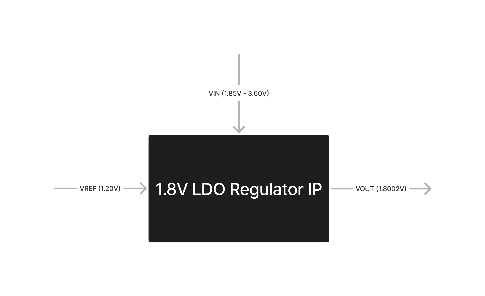
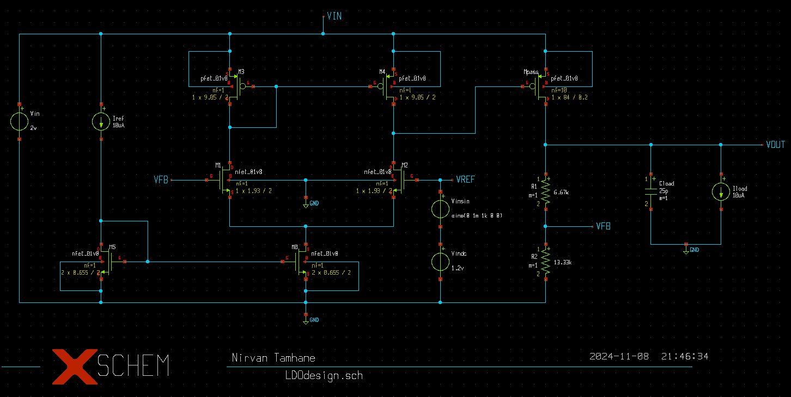
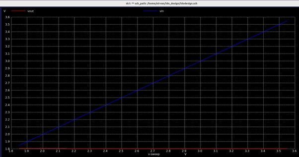
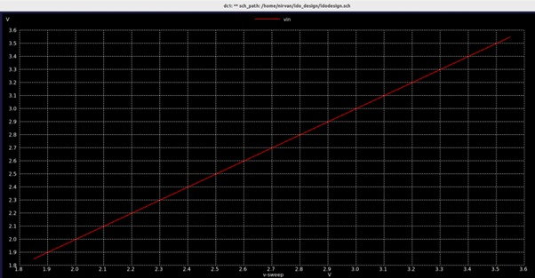
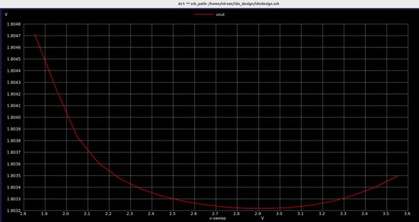
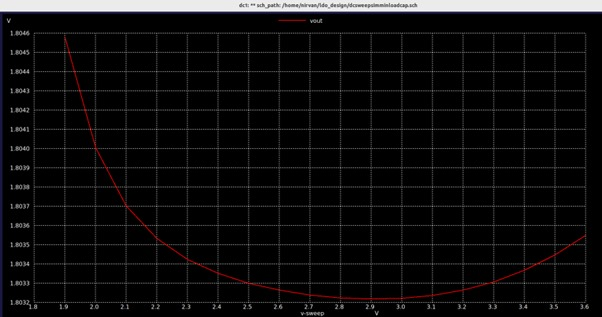
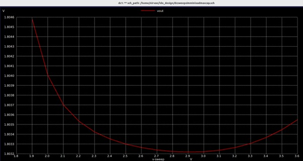
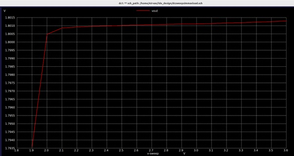
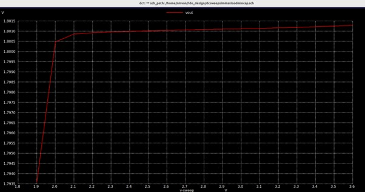
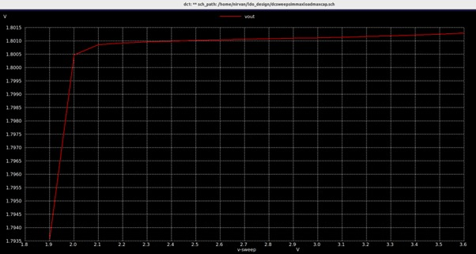

# 1.8V CMOS Low Drop-Out Regulator Design
This project simulates the designed LDO regulator circuit to determine its pre-layout performance characteristics.

## A Glance at the 1.8V LDO Regulator IP

To learn more about LDO Regulators, their principle of generation, implementation, issues & improvements, consider reading [this](/Documentation/BGR.pdf).

To gain insight into the applications and significance of LDO Regulators in VLSI, look at [this](/Documentation/Applications.pdf).

The  Design Specifications of the designed LDO Regulator Circuit can be found [here](/Documentation/Specifications.pdf).

## Block Diagram of the 1.8V LDO Regulator IP

 <p align="center">
  
</p>

## Circuit Diagram of the 1.8V LDO Regulator IP

 <p align="center">
  
</p>

## 1.8V LDO Regulator Performance Parameters 

| Parameter| Description| Min | Type | Max | Unit | Condition |
| :---:  | :-: | :-: | :-: | :---:  | :-: | :-: |
|Technology| 130 nm CMOS Process using Skywater 130 pdk|
|IL|Load current at Vout terminal | 10|||mA|Vin=2.0V, T=27C|
|CL|Load capacitance at Vout terminal|||25|pF|Vin=2.0V, T=27C, IL=1mA|
|Vout|Output voltage|1.792 |1.8002|1.8005|V|Vin=1.85V - 3.6V, T=27C|
|VDD|Supply Voltage|1.85|2.0|3.6|V|T=-40C to 125C|
|ISSPD|PMOS Driver Supply Current||90||uA|
|ISSOP|5T-OTA Amplifier Supply Current||10||uA|
|Line Regulation|(ΔVout/ΔVin)*100%||||0.43||||%|
|Load Regulation|[(ΔVout/ΔVin)*100%]/ΔVin||||0.215||||%|

## Pre-Layout Performance Characteristics

###  Vout v/s Vin [1.85V - 3.6V] @ IL = 10uA & CL = 25pF


 <p align="center">
  
</p>

<p align="center">
  
</p>

<p align="center">
  
</p>

###  Vout at Vin [1.85V - 3.6V] @ IL = 10uA & CL = 20pF


 <p align="center">
  
</p>

###  Vout at Vin [1.85V - 3.6V] @ IL = 10uA & CL = 30pF


 <p align="center">
  
</p>

### Vout at Vin [1.85V - 3.6V] @ IL = 1mA & CL = 25pF


 <p align="center">
  
</p>

### Vout at Vin [1.85V - 3.6V] @ IL = 1mA & CL = 20pF


 <p align="center">
  
</p>

###  Vout at Vin [1.85V - 3.6V] @ IL = 1mA & CL = 30pF


 <p align="center">
  
</p>


## Tools used and steps to reproduce all waveforms (Tools allowed are xschem/eSim/ngspice) 
Ngspice is an open-source mixed-signal circuit simulator.

### Follow the following steps if you don't use an Ubuntu system:
#### Installing Ubuntu on Windows (WSL)
https://youtu.be/F8ngtWC0wbg?si=QZ5bzmx7Xl0prH5d
Download Oracle Virtual Box.
Download the Ubuntu v22.04 .iso disk image file.
Create a new VM using the image file.

Give sudo access to the user: https://youtu.be/ERh74y-3EW8?si=Dhhi8bF1wqugm3AO
Open your terminal and type the following to install Linux packages: 
```
# sudo apt update; 
# sudo apt install build-essential dkms linux-headers-$(uname -r)
```
Go to Devices, select the Insert CD disk file command, and follow the steps in this video.

### Follow the following steps if you use an Ubuntu system or already have it set up:

#### Download Git to clone the repository:
Download Git: https://youtu.be/bc3_FL9zWWs?si=uspbw3duaVZVIili

#### Download Xschem & Ngspice:
Download Xschem & Ngspice: https://www.youtube.com/watch?v=VCuyO7Chvc8&t=662s

## Running the Simulation


To enter the Ngspice Shell, open the terminal & type:
```
$ ngspice
```
To simulate a netlist, type:
```
ngspice 1 ->  source <filename>.cir
```

You can exit from the Ngspice Shell by typing:
```
ngspice 1 ->  exit
```
 <p align="center"> or </p>
 
```
ngspice 1 ->  quit
```

There are several waveforms that need to be obtained to observe the performance of the Bandgap reference circuit.

### Pre-Layout Simulation

To clone the Repository and download the Netlist files for Simulation, enter the following commands in your terminal.

```
$  sudo apt install -y git
$  git clone https://github.com/sherylcorina/avsdbgp_3v3
$  cd avsdbgp_3v3/Simulation/Ngspice_Simulation/Final_Simulation/PreLayout
```


### To obtain the Vout v/s Vin [1.85V - 3.6V] @ No Load plot


Run the netlist file using the following command.
```
$  ngspice pre_temp.cir
```
 <p align="center">
  
</p>


### To obtain the Vout v/s Vin [1.85V - 3.6V] @ IL = 10uA & CL = 25pF

Run the netlist file using the following command.
```
$  ngspice pre_supply.cir
```
 <p align="center">
  
</p>

### To obtain the Vout v/s Vin [1.85V - 3.6V] @ IL = 10uA & CL = 20pF

Run the netlist file using the following command.
```
$  ngspice pre_tc.cir
```
 <p align="center">
  
</p>

### To obtain the Vout v/s Vin [1.85V - 3.6V] @ IL = 10uA & CL = 30pF

Run the netlist file using the following command.
```
$  ngspice pre_tc.cir
```
 <p align="center">
  
</p>

### To obtain the Vout v/s Vin [1.85V - 3.6V] @ IL = 1mA & CL = 25pF

Run the netlist file using the following command.
```
$  ngspice pre_tc.cir
```
 <p align="center">
  
</p>

### To obtain the Vout v/s Vin [1.85V - 3.6V] @ IL = 1mA & CL = 20pF

Run the netlist file using the following command.
```
$  ngspice pre_tc.cir
```
 <p align="center">
  
</p>

### To obtain the Vout v/s Vin [1.85V - 3.6V] @ IL = 1mA & CL = 30pF

Run the netlist file using the following command.
```
$  ngspice pre_tc.cir
```
 <p align="center">
  
</p>

***************


## Future Work

1. Improved matching techniques such as Common Centroid / Interdigitisation need to be implemented while laying out the current mirror.
2. PNR for the designed circuit is yet to performed using the Open Source Tool provided by the OpenROAD project.
3. Corner Analysis Testing of the bandgap reference circuit is yet to be performed.
4. The load driving capability needs to be improved by addition of a buffer block such as an OTA or a common drain amplifier.
5. To adjust the reference voltage resistors must be trimmed using fuses, hence, resistor trimming must be employed in the circuit.
6. The design must be improved to provide a higher PSRR.
7. In the future an OTA based bandgap reference circuit will be developed with improved performance characteristics. Also, a second order bandgap reference will be studied and developed, to improve the temperature coefficient.
8. To solve the problem of unwanted parasitic BJTs being extracted due to the modification made in the Technology File.

## Contributors 

- **Nirvan Tamhane** 

## Acknowledgments
- Kunal Ghosh, Director, VSD Corp. Pvt. Ltd.
- Philipp Gühring, Software Architect, LibreSilicon Assocation
- Saroj Rout, Associate Professor & Chief Mentor of VLSI Center of Excellence SIT, Bhubaneswar, India
- Santunu Sarangi, Asst. Professor, SIT, Bhubaneswar, India
- Tim Edwards, Senior Vice President of Analog and Design at efabless corporation
- Ankur Sah, M.Tech Embedded Systems, NIT Jamshedpur

## Contact Information

- Sheryl Serrao, Undergraduate Student, Mumbai University sherylcorina@gmail.com
- Kunal Ghosh, Director, VSD Corp. Pvt. Ltd. kunalghosh@gmail.com
